<p align="center">
  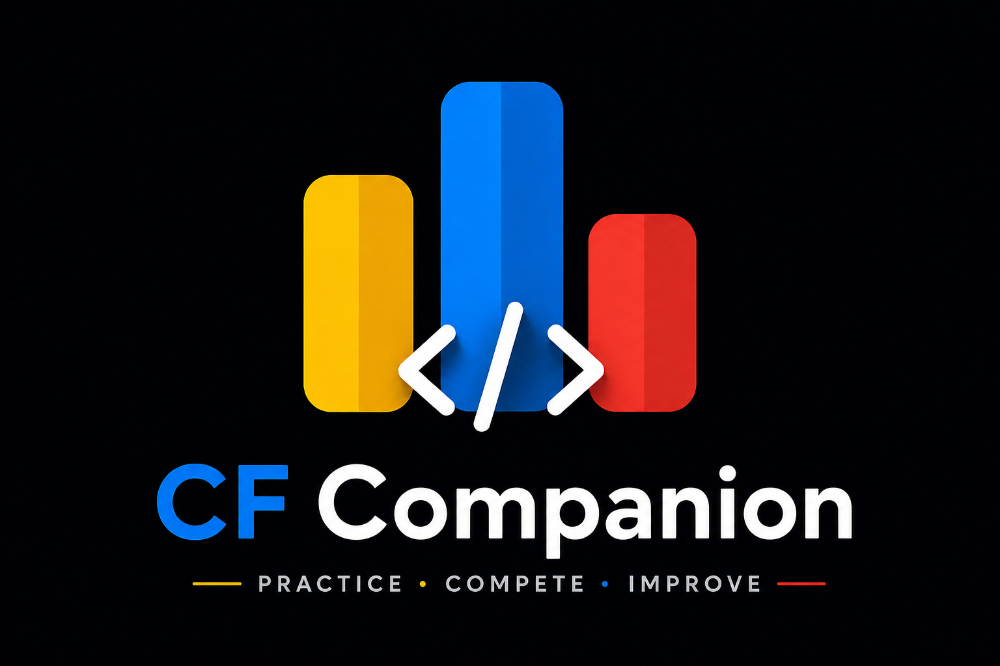
</p>

<h1 align="center">
  CF COMPANION
</h1>

<h4 align="center">The smart companion for competitive programmers.</h4>

<p align="center">
  <a href="#features">Features</a> •
  <a href="#architecture">Architecture</a> •
  <a href="#screenshots">Screenshots</a> •
  <a href="#prerequisites">Prerequisites</a> •
  <a href="#getting-started">Getting Started</a>
</p>

---

**CF Companion** is a sleek, brutalist Android application designed for Codeforces users. It provides real-time access to user profiles, contest history, problem archives, and friends, all wrapped in a visually aggressive and highly dynamic UI that adapts its entire color scheme based on your current Codeforces rank.

## Features

### Dynamic Brutalist UI & Rank Themes
- **Aggressive Typography:** Custom-integrated `Archivo Black` and `Space Mono Bold` fonts for a distinct, heavy brutalist aesthetic.
- **Rank-Reactive Theming:** The entire app dynamically recolors itself (backgrounds, borders, text, accents) using the `ThemeManager` to match your exact Codeforces rank (Newbie through Legendary Grandmaster).
- **Sharp Aesthetics:** Dark glassmorphism, 2dp solid stroke borders, and monospace styling.

### Secure Authentication & Handle Binding
- **Google Sign-In:** One-tap authentication using Firebase.
- **Guest Mode:** Browse without an account.
- **Handle Verification:** Link your exact Codeforces handle. The app automatically fetches your profile picture, rating, and contest history using the public Codeforces API.

### Real-Time Stats & Caching
- **Profile Dashboard:** View current rating, max rating, contribution, and rank.
- **Offline Caching:** Integrated `DataCache` and `SwipeRefreshLayout` for lightning-fast loading of problems and profiles.
- **Problem Archive:** Browse and filter Codeforces problems efficiently.

### In-App Friends & Battle Mode
- **Friends System:** Search for other competitive programmers and view their profiles.
- **Social Tracking:** Keep track of your rivals and friends directly within the app.

### Home Screen Widget
- **Dynamic Profile Widget:** A beautiful, responsive home screen widget.
- **Background Sync:** Uses `goAsync()` and Kotlin Coroutines to fetch data in the background without killing the process.
- **Theme Sync:** The widget perfectly reflects your current Codeforces rank colors in real-time.

---

## Screenshots

### Dynamic Rank Theming
The entire app seamlessly morphs its colors to reflect your Codeforces rank! Here is the Profile and Problems archive shown in both **Pupil (Green)** and **Expert (Blue)** themes:

<div align="center">
  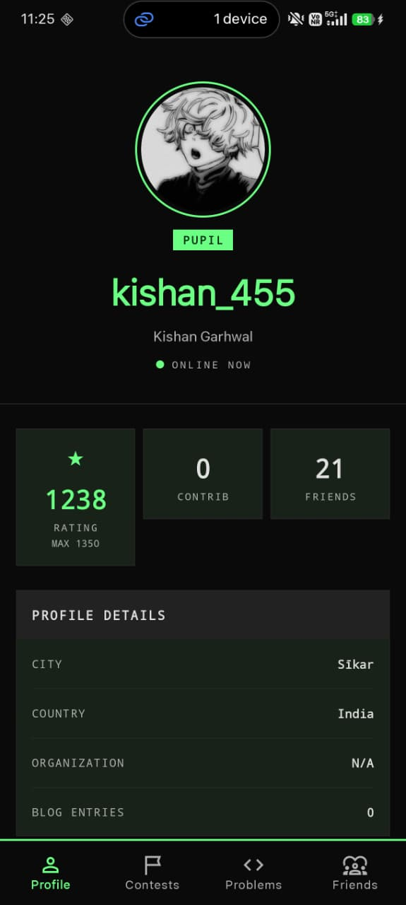
  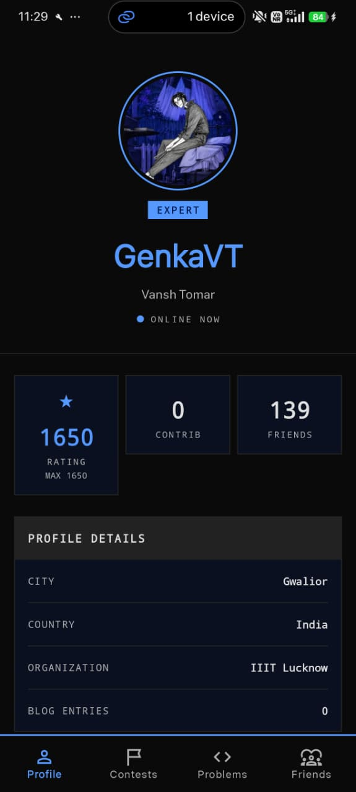
  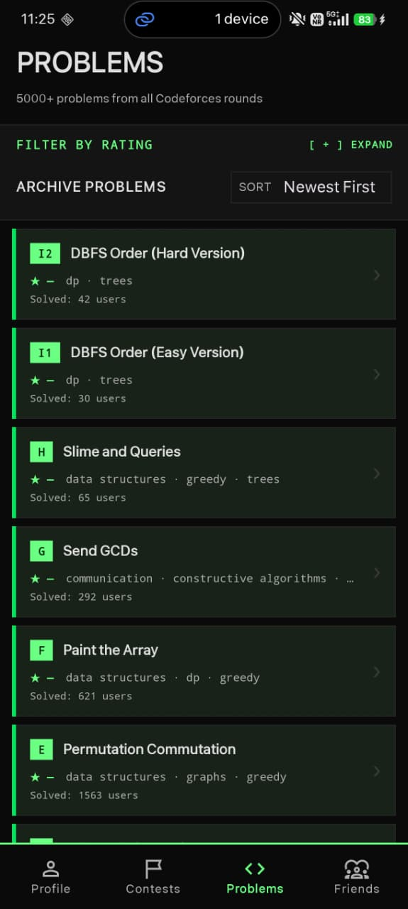
  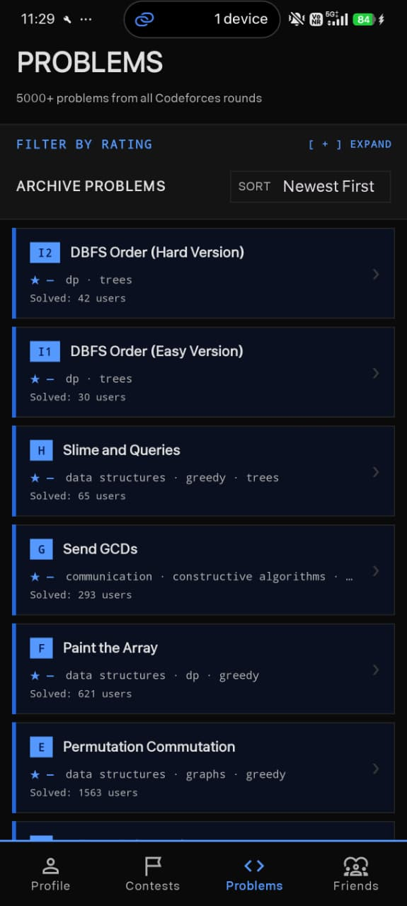
</div>

### Core Experience
<div align="center">
  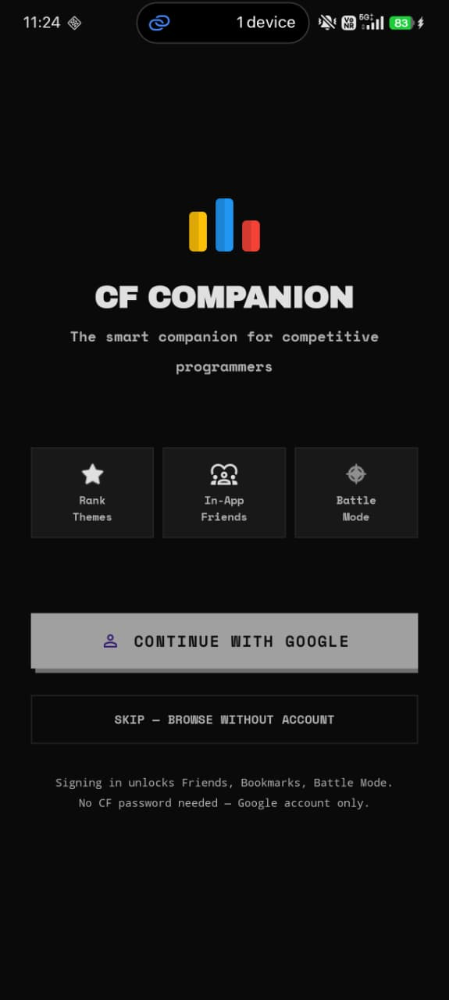
  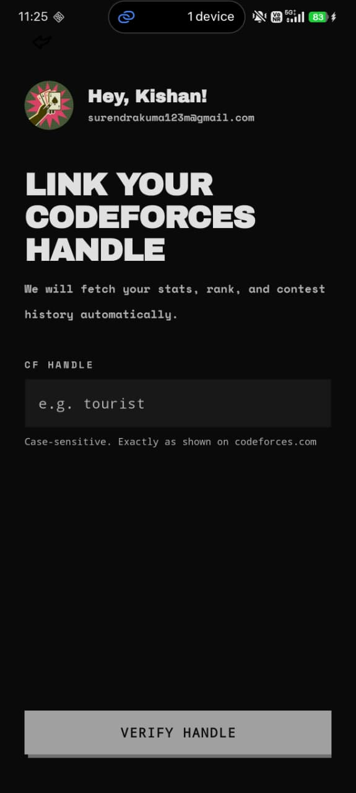
  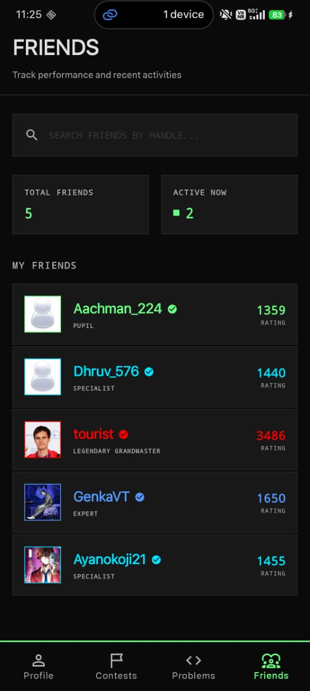
  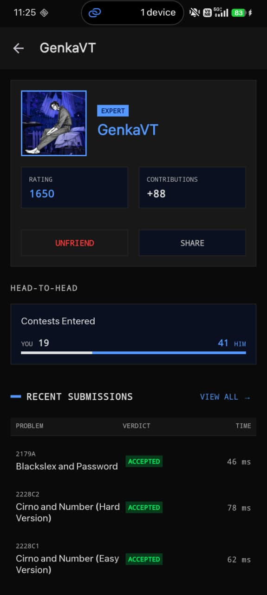
</div>

### Contests & Reminders
<div align="center">
  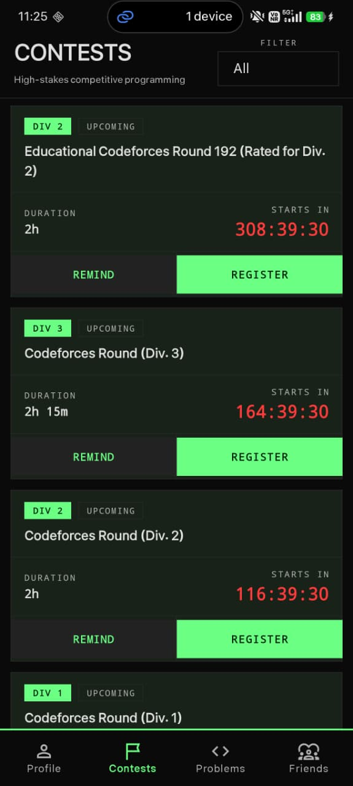
  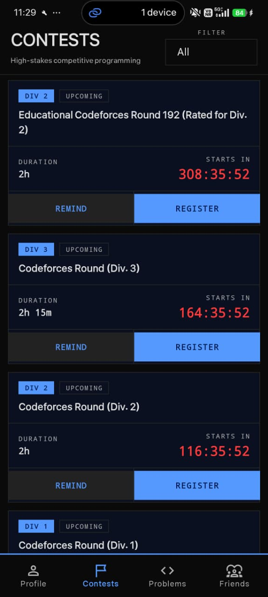
  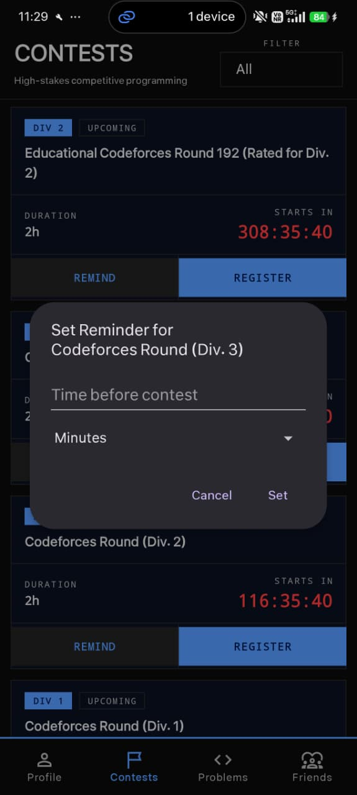
  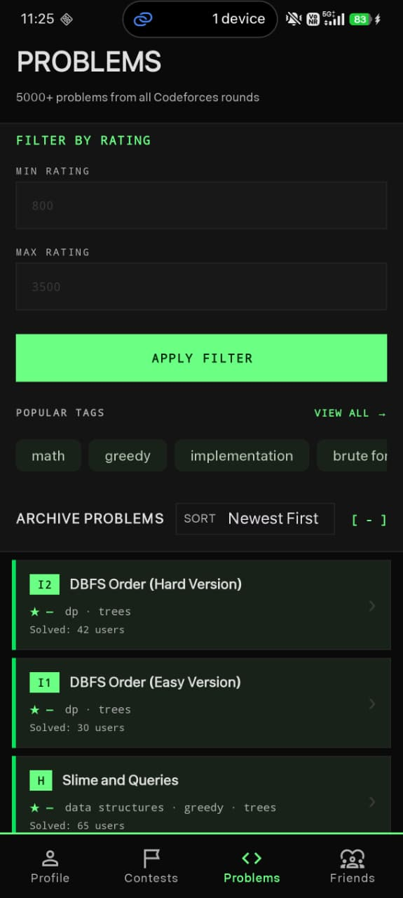
</div>

### Home Screen Widget
Stay updated without opening the app! The widget perfectly syncs with your `ThemeManager` rank colors.

<div align="center">
  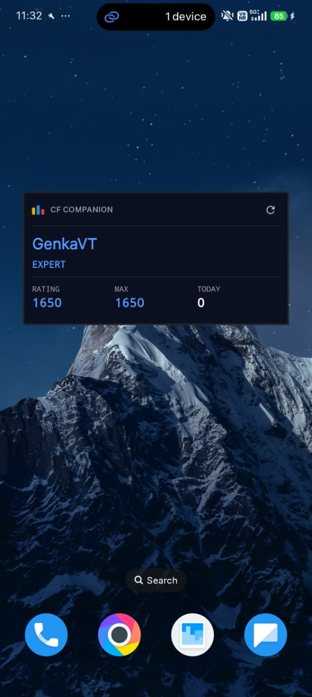
</div>

---

## Architecture

The project follows the **MVVM (Model-View-ViewModel)** architecture pattern, leveraging modern Android development practices:

```text
com.example.codeforces/
├── api/                  # CodeforcesApiService (Retrofit)
├── repository/           # Single source of truth (UserRepository, etc.)
├── models/               # Data classes matching Codeforces API responses
├── ui/
│   ├── auth/             # AuthActivity, EnterUsernameActivity, HandleBindingActivity
│   ├── profile/          # ProfileFragment, FriendProfileActivity
│   ├── problems/         # ProblemsFragment (with Paging/Caching)
│   └── friends/          # FriendsFragment
├── utils/
│   ├── ThemeManager.kt   # Core rank-based dynamic styling engine
│   └── DataCache.kt      # Efficient offline caching
└── widget/
    └── ProfileWidget.kt  # AppWidgetProvider with coroutine data fetching
```

---

## Prerequisites
Before you begin, ensure you have:
- **Android Studio** Ladybug or newer.
- **JDK 17** or higher.
- A **Firebase** project configured for Android (for Google Sign-In).

## Getting Started

### 1. Clone the Repository
```bash
git clone https://github.com/yourusername/CodeForcesCompanion.git
cd CodeForcesCompanion
```

### 2. Configure Firebase
1. Go to the [Firebase Console](https://console.firebase.google.com/) and create a new project.
2. Add an Android app with the package name `com.example.codeforces`.
3. Download the `google-services.json` file and place it inside the `app/` directory.
   > **Note:** `google-services.json` is safely `.gitignore`d to prevent credential leaks.
4. Enable **Google** in the Firebase Authentication sign-in providers.

### 3. Build and Run
1. Open the project in Android Studio.
2. Click **Sync Project with Gradle Files**.
3. Select a device or emulator (API 24+).
4. Click **Run** (Shift + F10).

---

## App Flow
```text
Splash Screen
      │
      ├── (Not logged in) ──> AuthActivity (Google / Skip) <──> HandleBindingActivity
      │
      └── (Logged in) ──────> MainActivity (Bottom Navigation)
                                  ├─ Profile
                                  ├─ Problems
                                  ├─ Contests
                                  └─ Friends
```

## Contributing
Contributions are always welcome!
1. Fork the repository.
2. Create a feature branch (`git checkout -b feature/amazing-feature`).
3. Commit your changes (`git commit -m 'Add amazing feature'`).
4. Push to the branch (`git push origin feature/amazing-feature`).
5. Open a Pull Request.
